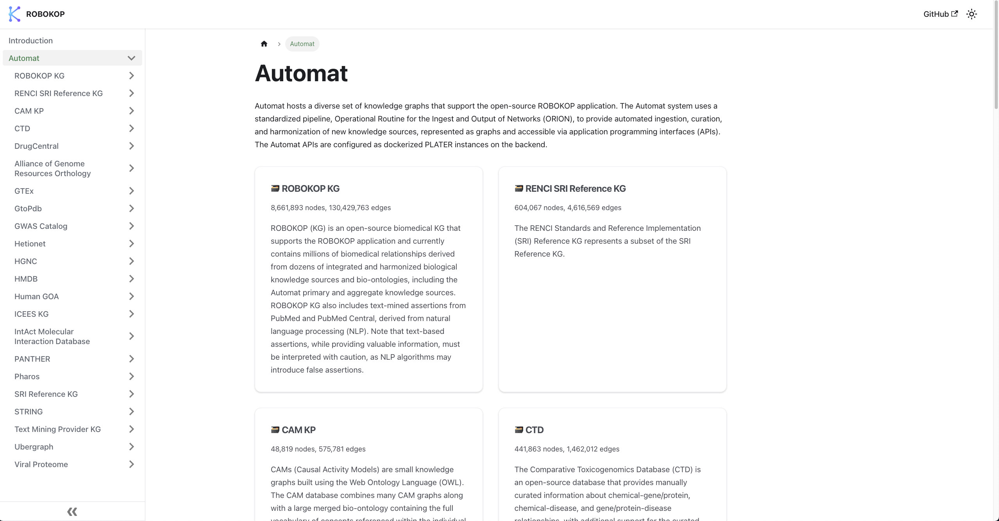
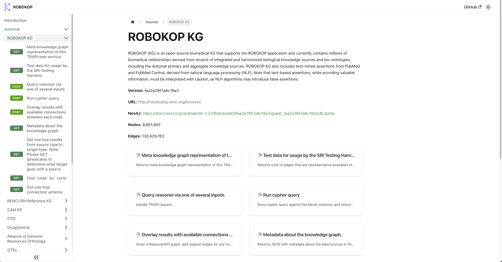
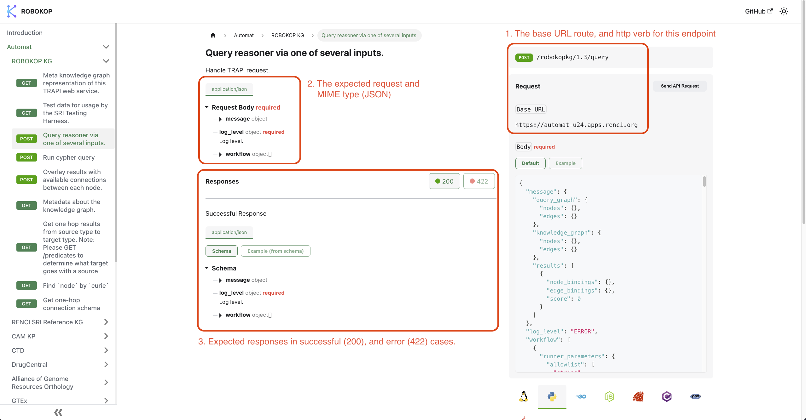

import endpointTester from "./img/endpoint-tester.png";
import endpointCodegen from "./img/endpoint-codegen.png";

# Introduction

This article provides an explanation of the Automat API docs site and how to use it to programmatically
access information and data about ROBOKOP.

---

## Overview of Graph Sources

ROBOKOP consists of a number of curated knowledge graphs that specialize in different domains (for
instance, genes, proteins or chemical entities). As part of the curation process,
[PLATERs](https://github.com/TranslatorSRI/Plater) are generated, which expose the underlying Neo4j
graph databases as a series of [OpenAPI compliant](https://www.openapis.org/) HTTP APIs. In addition,
the ROBOKOP KG, which contains all the individual knowledge graphs, can be queried the same way,
allowing the user to construct cross-domain questions and receive more detailed responses.

Clicking the [Automat](/docs/category/automat) item in the sidebar opens the overview page, showing a
list of all the current knowledge graphs supported by ROBOKOP. Each card contains the:

- title of the graph
- current node and edge count
- a description of the source

 

 
 

## Information About a Knowledge Graph Source

Notice that the cards listed on the overview page are also listed in the sidebar on the left-hand side.
To view more information about a source, either click that source's card on the overview page, or click
on the source's name in the sidebar.

At the top of this page is the summary, along with some additional information:

| Name    | Description                                                                                           |
| ------- | ----------------------------------------------------------------------------------------------------- |
| Version | A unique identifier given to this version of the knowledge graph.                                     |
| URL     | A link to more information about this knowledge graph from its maintainers.                           |
| Neo4J   | A download link for this knowledge graph, if you'd like to self host or analyze this dataset locally. |
| Nodes   | Total number of nodes in this knowledge graph.                                                        |
| Edges   | Total number of edges in this knowledge graph.                                                        |

 
 

## Endpoints Available for a Knowledge Graph

You can view a list of the available endpoints for a source by either opening the dropdown on the source's
name in the sidebar, or by clicking a card on the knowledge graph overview page (previous image). The colored tag
in the sidebar displays the HTTP verb associated with that endpoint, and the text provides a description of the
endpoint's action.

 
 

## Inspecting an Endpoint

Clicking an endpoint brings you to its page, which describes what it is, how to use it, and the shape of the data
it expects to receive and respond with.

1. This section tells you where and how this data is being sent to the service to retrieve the data. In this case,
   the request is a `POST` to `https://automat-u24.apps.renci.org/robokopkg/1.3/query`.
2. This section tells you what you need to send to successfully use this endpoint. In this example, there is a required
   request body. You can click the dropdowns to expand the object and view required and optional fields. If there are
   query or path parameters instead, they will also be in this section.
3. This section details the possible responses that can be expected. Clicking the buttons in the top right switches the
   display between the successful and error states. Also note that some endpoints may have examples of a response.
   This can be viewed by clicking the `Example (from schema)` button.

 
 

### Using the Endpoint Tester

Each endpoint page comes with an endpoint testing interface on the right-hand side of the page.

1. Click this button to submit the request
2. This area represents the data being sent to the server in the request. The buttons `Default` and `Example` can be
   used to switch between the "empty" request and an example defined in the schema. We recommend basing your queries
   off the provided examples, where they are provided. Regardless, whether you start with the default or example, you
   can make edits to the request body in the text box prior to submitting. If an endpoint has path or query parameters,
   they will show up here as well.

Once you have adjusted the request body or selected and example and clicked `Send API Request`, the tester will show
`Loading...`. Once it has completed, a `Response` section will appear, containing the returned JSON. You can click
`Clear` and return to the request section if you'd like to send another request.

 
 

### HTTP Request Codegen

In addition to configuring the endpoint tester, filling in the request section will generate HTTP request code in several
languages. Below the endpoint tester, you will see a list of tabs each containing a language. Clicking on one of these
will bring up code for that language, which can then be copied by clicking the button in the top-right of the code block.
For example, here is a Python code segment for the example request on the `Run cypher query` endpoint.

 
 

## Questions

If you have any questions, concerns, or want clarification about Automat, [send us a message](https://robokop.renci.org/#contact)
or visit [ROBOKOP Office Hours](https://robokop.renci.org/#events)
